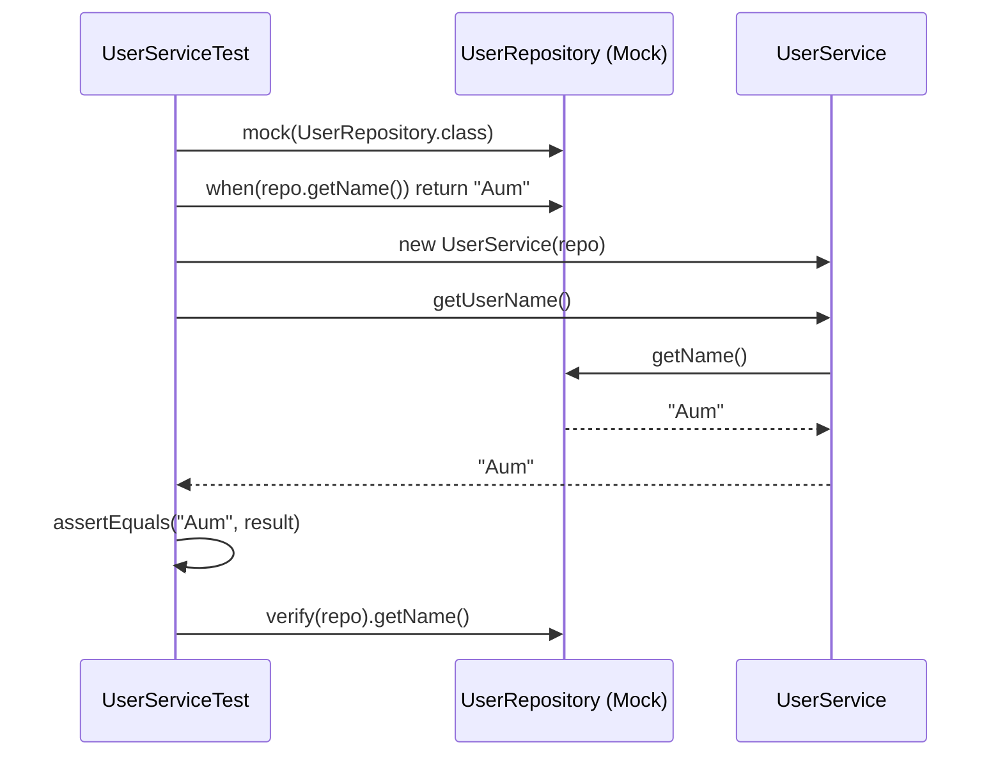
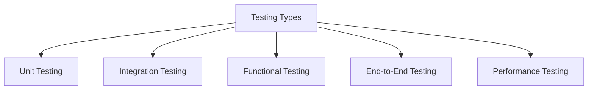

# Module 6 - Mockito, Lombok, SLF4J & Automation Testing

Welcome to **Module 6**! This module is structured into three isolated, runnable project subfolders, followed by comprehensive theoretical revision for your software test automation assessments.

Each subfolder contains its own self-contained Maven configuration (`pom.xml`) with only the necessary dependencies, ensuring a clean separation of technologies.

---

## 📚 Table of Contents
1. [MockitoDemo: Mocking & Stubbing (Isolated Project)](#1-mockitodemo-mocking--stubbing)
2. [LombokDemo: Boilerplate Reduction (Isolated Project)](#2-lombokdemo-boilerplate-reduction)
3. [SLF4JDemo: Modern Logging Facade (Isolated Project)](#3-slf4jdemo-modern-logging-facade)
4. [Automation Testing Theory (Quick Revision)](#4-automation-testing-theory-quick-revision)
5. [FSE Assessment Cheat Sheet](#5-fse-assessment-cheat-sheet)

---

## 1. MockitoDemo: Mocking & Stubbing

### Why Use Mocking?
In enterprise applications, classes have dependencies (e.g., a `UserService` depends on a `UserRepository` that talks to a real database). 
If we test `UserService` using the real database, the tests become slow, fragile, and complex to run.

**Mockito** solves this by creating **mock (fake) objects** that simulate the behavior of real dependencies. This isolates the unit under test.

### Core Mockito Methods

| Method | Purpose | Code Example |
| :--- | :--- | :--- |
| **`mock(Class)`** | Creates a fake instance of the class/interface. All method calls return default values (`null`, `0`, `false`). | `UserRepository repo = mock(UserRepository.class);` |
| **`when().thenReturn()`** | Stubs the behavior. Instructs the fake object to return a specific value when a method is called. | `when(repo.getName()).thenReturn("Aum");` |
| **`verify()`** | Asserts whether a specific method on the mock was actually called. | `verify(repo).getName();` |

### Isolated Project Resources
* **Maven Configuration**: [MockitoDemo/pom.xml](file:///c:/Users/ommul/OneDrive/Desktop/cognizant/Module%206%20-%20Mockito%20Lombok%20SLF4J%20and%20Automation/MockitoDemo/pom.xml)
* **Main Classes**:
  - [UserRepository.java](file:///c:/Users/ommul/OneDrive/Desktop/cognizant/Module%206%20-%20Mockito%20Lombok%20SLF4J%20and%20Automation/MockitoDemo/src/main/java/com/learning/user/UserRepository.java)
  - [UserService.java](file:///c:/Users/ommul/OneDrive/Desktop/cognizant/Module%206%20-%20Mockito%20Lombok%20SLF4J%20and%20Automation/MockitoDemo/src/main/java/com/learning/user/UserService.java)
* **Unit Test**:
  - [UserServiceTest.java](file:///c:/Users/ommul/OneDrive/Desktop/cognizant/Module%206%20-%20Mockito%20Lombok%20SLF4J%20and%20Automation/MockitoDemo/src/test/java/com/learning/user/UserServiceTest.java)

#### Mocking Execution Flow


---

## 2. LombokDemo: Boilerplate Reduction

### Why Use Lombok?
Standard Java classes require writing getters, setters, constructors, `toString()`, `equals()`, and `hashCode()` methods. 
Lombok uses annotations to automatically generate this code at compile time.

> [!NOTE]
> **How Lombok Works Under the Hood**: 
> Lombok hooks into the Java Compiler API via **JSR 269 Annotation Processing**. During compile-time, it intercepts the Abstract Syntax Tree (AST) of the Java source file, automatically injects the compiled bytecode for getters, setters, etc., and closes. The resulting compiled `.class` files contain the full boilerplate without it cluttering your source code!

### Key Lombok Annotations

* **`@Getter` & `@Setter`**: Generates getters and setters for fields.
* **`@Data`**: The most common utility annotation. It is a bundle that automatically applies:
  - `@Getter` and `@Setter` on all non-static fields.
  - `@ToString` representation.
  - `@EqualsAndHashCode` comparisons.
  - `@RequiredArgsConstructor` for all final/non-null fields.
* **`@Builder`**: Generates the **Builder Pattern** for object construction, making instance creation clean and fluent.

#### Before vs. After Lombok Comparison

**Without Lombok 😭**
```java
class Student {
    private int id;
    private String name;

    public int getId() { return id; }
    public void setId(int id) { this.id = id; }
    public String getName() { return name; }
    public void setName(String name) { this.name = name; }
    // Constructor, toString, equals, hashCode... (approx. 50 lines of code)
}
```

**With Lombok 😄**
```java
import lombok.Data;
import lombok.Builder;

@Data
@Builder
class Student {
    private int id;
    private String name;
}
```

**Fluent Object Construction via `@Builder`**:
```java
Student s = Student.builder()
                   .id(101)
                   .name("Aum")
                   .build();
```

### Isolated Project Resources
* **Maven Configuration**: [LombokDemo/pom.xml](file:///c:/Users/ommul/OneDrive/Desktop/cognizant/Module%206%20-%20Mockito%20Lombok%20SLF4J%20and%20Automation/LombokDemo/pom.xml)
* **Main Classes**:
  - [Student.java](file:///c:/Users/ommul/OneDrive/Desktop/cognizant/Module%206%20-%20Mockito%20Lombok%20SLF4J%20and%20Automation/LombokDemo/src/main/java/com/learning/student/Student.java)
* **Unit Test**:
  - [StudentTest.java](file:///c:/Users/ommul/OneDrive/Desktop/cognizant/Module%206%20-%20Mockito%20Lombok%20SLF4J%20and%20Automation/LombokDemo/src/test/java/com/learning/student/StudentTest.java)

---

## 3. SLF4JDemo: Modern Logging Facade

### Why SLF4J instead of `System.out.println`?
1. **Performance**: `System.out.println` is synchronous and blocks the main execution thread. Modern loggers process IO asynchronously.
2. **Granularity**: Console outputs cannot be filtered. Logging libraries allow filtering by log levels (e.g. disabling debug logs in production).
3. **Decoupling**: **SLF4J (Simple Logging Facade for Java)** is a facade (abstraction) layer. It allows developers to write code against a single logging API, while backing implementations (like Logback or Log4J) can be changed easily via dependencies without modifying source code.

### Core Logging Levels

1. **`INFO`**: Normal, expected application events (e.g., `"User Aum logged in successfully"`).
2. **`WARN`**: Suspicious activity or non-fatal anomalies that need observing (e.g., `"User login failed from new IP address"`).
3. **`ERROR`**: Runtime failures or major defects requiring immediate attention (e.g., `"Database connection timed out"`).

### 💡 Parameterized Logging (Placeholders)
> [!IMPORTANT]
> Always avoid manual string concatenation in logger statements.
> - **Bad Practice**: `logger.info("User " + username + " logged in.");` (Allocates memory for String concatenation regardless of whether the log level is enabled).
> - **Best Practice**: `logger.info("User {} logged in.", username);` (SLF4J checks if the `INFO` level is enabled first. String construction is deferred and only executed if the logs are active, saving valuable CPU cycles).

### Isolated Project Resources
* **Maven Configuration**: [SLF4JDemo/pom.xml](file:///c:/Users/ommul/OneDrive/Desktop/cognizant/Module%206%20-%20Mockito%20Lombok%20SLF4J%20and%20Automation/SLF4JDemo/pom.xml)
* **Main Classes**:
  - [LoggingDemo.java](file:///c:/Users/ommul/OneDrive/Desktop/cognizant/Module%206%20-%20Mockito%20Lombok%20SLF4J%20and%20Automation/SLF4JDemo/src/main/java/com/learning/logging/LoggingDemo.java)
* **Unit Test**:
  - [LoggingDemoTest.java](file:///c:/Users/ommul/OneDrive/Desktop/cognizant/Module%206%20-%20Mockito%20Lombok%20SLF4J%20and%20Automation/SLF4JDemo/src/test/java/com/learning/logging/LoggingDemoTest.java)

---

## 4. Automation Testing Theory (Quick Revision)

This section provides a summarized guide to core testing terms and automation concepts for exams and technical interviews.

### Types of Testing



* **Unit Testing**: Testing the smallest functional unit (a single class or method) in isolation from external systems. Dependencies are mocked.
* **Integration Testing**: Verifying how multiple components interact (e.g., testing the Controller layer, Service layer, and Database layer together).
* **Functional Testing**: Verifying the software behaves exactly according to business requirements and specifications (e.g., validating correct interest calculation).
* **End-to-End (E2E) Testing**: Simulating a real user journey by testing the application flow from the UI, through services and databases, to external interfaces.
* **Performance Testing**: Evaluating system speed, responsiveness, resource usage, and stability under a specific stress or user load.

### Popular Automation Tools

* **JUnit / TestNG**: Java unit testing, lifecycle, and assertion frameworks.
* **Selenium / Cypress**: Web UI browser testing automation. (Selenium is multi-language/multi-browser, Cypress is JavaScript-based and runs inside the browser).
* **Appium**: Mobile application testing framework (iOS and Android).
* **Cucumber**: Behavior-Driven Development (BDD) testing tool using human-readable `Gherkin` syntax (`Given`, `When`, `Then`).

---

## 5. FSE Assessment Cheat Sheet

Quick reference summary for FSE Assessment:

```text
Mockito
├── mock()         -> Creates a fake object for dependency isolation.
├── when()         -> Stubbing: Defines expected method call triggers.
├── thenReturn()   -> Returns a predetermined mock response.
└── verify()       -> Verifies if a method was called on a mock.

Lombok
├── @Getter        -> Auto-generates getter methods.
├── @Setter        -> Auto-generates setter methods.
├── @Data          -> Combo: Getters, Setters, Equals, HashCode, and ToString.
└── @Builder       -> Implements clean Builder pattern.

SLF4J Logging
├── info()         -> Normal operational messages.
├── warn()         -> Warnings about unexpected flow.
├── error()        -> Catches failures and exceptions.
└── Placeholder {} -> Deferred concatenation optimization.

Automation Testing
├── Levels         -> Unit, Integration, Functional, E2E, Performance.
└── Key Tools      -> JUnit, TestNG, Selenium, Appium, Cucumber, Cypress.
```
